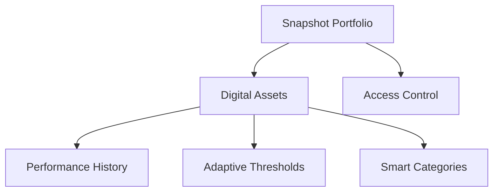

# Snapshot Virtual Machine

A decentralized, blockchain-native protocol for tracking, analyzing, and managing digital asset portfolios with advanced privacy and monitoring capabilities.

## Overview

Snapshot Virtual Machine (Snapshot VM) empowers users to:
- Create immutable digital asset portfolios
- Track comprehensive asset performance
- Implement dynamic monitoring strategies
- Control granular access permissions
- Generate real-time portfolio insights
- Maintain transparent, compliant records

## Architecture

The protocol is designed around a flexible, modular system of virtual asset containers with comprehensive tracking and adaptive monitoring mechanisms.



### Core Components:
- **Portfolios**: Secure, programmable asset containers
- **Assets**: Dynamically tracked digital resources
- **History**: Immutable performance chronicle
- **Categories**: Intelligent asset classification
- **Thresholds**: Adaptive monitoring rules
- **Access Management**: Fine-grained viewer permissions

## Contract Documentation

### Main Contract: snapshot-vm.clar

The core protocol implementing the Snapshot Virtual Machine's asset management logic.

#### Key Data Structures:
- `assets`: Immutable digital asset records
- `asset-history`: Comprehensive performance tracking
- `user-categories`: Intelligent asset classification
- `vaults`: Dynamic portfolio metadata
- `authorized-viewers`: Granular access control
- `monitoring-thresholds`: Adaptive monitoring rules

## Getting Started

### Prerequisites
- Clarinet CLI
- Stacks wallet
- Basic understanding of decentralized asset management

### Basic Usage

1. Initialize a portfolio:
```clarity
(contract-call? .snapshot-vm register-portfolio "Personal Investments" false)
```

2. Register a digital asset:
```clarity
(contract-call? .snapshot-vm register-asset 
    "crypto-001" 
    "Bitcoin Allocation" 
    "Digital Currency" 
    u1635724800 
    u50000 
    u55000 
    none 
    false)
```

3. Update asset valuation:
```clarity
(contract-call? .snapshot-vm update-asset-value "crypto-001" u60000)
```

## Function Reference

### Asset Management

#### register-asset
```clarity
(register-asset 
    (asset-id (string-ascii 36))
    (name (string-utf8 100))
    (category (string-ascii 50))
    (acquisition-date uint)
    (acquisition-cost uint)
    (current-value uint)
    (metadata (optional (string-utf8 1000)))
    (public-view bool))
```

#### update-asset-value
```clarity
(update-asset-value (asset-id (string-ascii 36)) (new-value uint))
```

### Access Control

#### authorize-viewer
```clarity
(authorize-viewer (viewer principal) (expiration (optional uint)))
```

#### revoke-viewer
```clarity
(revoke-viewer (viewer principal))
```

### Monitoring

#### set-threshold
```clarity
(set-threshold
    (asset-id (string-ascii 36))
    (threshold-id (string-ascii 36))
    (comparison (string-ascii 2))
    (value uint)
    (description (optional (string-utf8 200))))
```

## Development

### Local Testing

1. Initialize project:
```bash
clarinet new snapshot-vm
```

2. Run tests:
```bash
clarinet test
```

3. Start local chain:
```bash
clarinet console
```

## Security Considerations

### Access Control
- All asset operations require owner authentication
- Viewer access can be time-limited
- Public visibility is configurable per asset

### Data Privacy
- Asset details are only visible to authorized parties
- Historical records are immutable once created
- Metadata can be optionally included or excluded

### Limitations
- No support for fractional ownership
- Asset values must be represented as integers
- Threshold monitoring requires external triggers

### Best Practices
- Regularly review authorized viewers
- Set expiration dates for temporary access
- Keep sensitive details in metadata optional
- Validate all inputs before transactions# Snapshot Virtual Machine

A decentralized, blockchain-native protocol for tracking, analyzing, and managing digital asset portfolios with advanced privacy and monitoring capabilities.

## Overview

Snapshot Virtual Machine (Snapshot VM) empowers users to:
- Create immutable digital asset portfolios
- Track comprehensive asset performance
- Implement dynamic monitoring strategies
- Control granular access permissions
- Generate real-time portfolio insights
- Maintain transparent, compliant records

## Architecture

The protocol is designed around a flexible, modular system of virtual asset containers with comprehensive tracking and adaptive monitoring mechanisms.


### Core Components:
- **Portfolios**: Secure, programmable asset containers
- **Assets**: Dynamically tracked digital resources
- **History**: Immutable performance chronicle
- **Categories**: Intelligent asset classification
- **Thresholds**: Adaptive monitoring rules
- **Access Management**: Fine-grained viewer permissions

## Contract Documentation

### Main Contract: snapshot-vm.clar

The core protocol implementing the Snapshot Virtual Machine's asset management logic.

#### Key Data Structures:
- `assets`: Immutable digital asset records
- `asset-history`: Comprehensive performance tracking
- `user-categories`: Intelligent asset classification
- `vaults`: Dynamic portfolio metadata
- `authorized-viewers`: Granular access control
- `monitoring-thresholds`: Adaptive monitoring rules

## Getting Started

### Prerequisites
- Clarinet CLI
- Stacks wallet
- Basic understanding of decentralized asset management

### Basic Usage

1. Initialize a portfolio:
```clarity
(contract-call? .snapshot-vm register-portfolio "Personal Investments" false)
```

2. Register a digital asset:
```clarity
(contract-call? .snapshot-vm register-asset 
    "crypto-001" 
    "Bitcoin Allocation" 
    "Digital Currency" 
    u1635724800 
    u50000 
    u55000 
    none 
    false)
```

3. Update asset valuation:
```clarity
(contract-call? .snapshot-vm update-asset-value "crypto-001" u60000)
```

## Function Reference

### Asset Management

#### register-asset
```clarity
(register-asset 
    (asset-id (string-ascii 36))
    (name (string-utf8 100))
    (category (string-ascii 50))
    (acquisition-date uint)
    (acquisition-cost uint)
    (current-value uint)
    (metadata (optional (string-utf8 1000)))
    (public-view bool))
```

#### update-asset-value
```clarity
(update-asset-value (asset-id (string-ascii 36)) (new-value uint))
```

### Access Control

#### authorize-viewer
```clarity
(authorize-viewer (viewer principal) (expiration (optional uint)))
```

#### revoke-viewer
```clarity
(revoke-viewer (viewer principal))
```

### Monitoring

#### set-threshold
```clarity
(set-threshold
    (asset-id (string-ascii 36))
    (threshold-id (string-ascii 36))
    (comparison (string-ascii 2))
    (value uint)
    (description (optional (string-utf8 200))))
```

## Development

### Local Testing

1. Initialize project:
```bash
clarinet new snapshot-vm
```

2. Run tests:
```bash
clarinet test
```

3. Start local chain:
```bash
clarinet console
```

## Security Considerations

### Access Control
- All asset operations require owner authentication
- Viewer access can be time-limited
- Public visibility is configurable per asset

### Data Privacy
- Asset details are only visible to authorized parties
- Historical records are immutable once created
- Metadata can be optionally included or excluded

### Limitations
- No support for fractional ownership
- Asset values must be represented as integers
- Threshold monitoring requires external triggers

### Best Practices
- Regularly review authorized viewers
- Set expiration dates for temporary access
- Keep sensitive details in metadata optional
- Validate all inputs before transactions